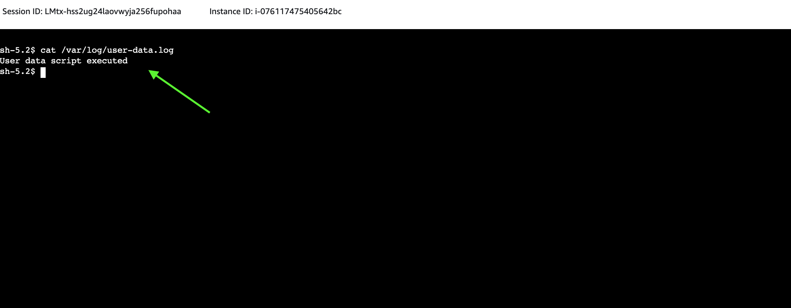

# How to pre-configure EC2 instances using AWS CDK and avoid a nasty trap?

## Introduction

In this article, I will explain deploying an EC2 instance using AWS CDK and Python code. I will present how we can pre-configure that instance and execute a custom script during the first boot.

## The EC2 User Data

We can store parameters or scripts as *user data*. Those scripts will run when during the EC2 instance launch. It is crucial to note that the *user data* script executes **ONLY once** during the initial boot. If we are not careful, that constraint lays a nasty trap. In a second, you will know what I am talking about.

You can read more about *user data* in the [official documentation](https://docs.aws.amazon.com/AWSEC2/latest/UserGuide/instancedata-add-user-data.html).

## AWS CDK

The AWS CDK (Cloud Development Kit) is an open-source software development framework for defining cloud infrastructure in code and provisioning it through AWS CloudFormation. I am a huge fan of this solution as it enables efficient management of AWS Cloud infrastructure. AWS CDK supports several languages. In this example, I will use [AWS CDK in Python](https://docs.aws.amazon.com/cdk/v2/guide/work-with-cdk-python.html).

You can read more about AWS CDK in the [official documentation](https://docs.aws.amazon.com/cdk/v2/guide/home.html).

**NOTE:** This article is not an AWS CDK tutorial; my goal is to explain a particular use case. That scenario is frequently used during commercial initiatives utilizing AWS Cloud. Please get in touch with me if you are interested in AWS CDK training (lmtx@thingrex.com).

## Pre-requisites

To follow along, you must have access to an AWS Account and installed AWS CDK.

Please consult the AWS documentation:

* [Installation of AWS CLI and AWS CDK](https://docs.aws.amazon.com/cdk/v2/guide/getting_started.html)
* [Setup of AWS CDK in Python](https://docs.aws.amazon.com/cdk/v2/guide/work-with-cdk-python.html)

## Obtaining the source code

The source code is available on my GitHub: https://github.com/LMtx/AWS-CDK-EC2-user-data

## Let's get started!

### Account bootstrap

If you have not used AWS CDK before, you must bootstrap your account and deploy the CDK toolkit stack, invoke:

`cdk bootstrap`

### First deployment

Now you are ready to deploy test infrastructure, invoke:

`cdk deploy`

Type `y` to accept the changes so CDK can create the AWS infrastructure.


Your first deployment has started! We need to wait a few minutes for the creation of AWS assets.


... and our CDK deployment succeeded!


Let's switch to the AWS Web Console to inspect the outcomes.

### AWS Web Console

Log into your [AWS Account](https://console.aws.amazon.com/) and search for `EC2`:


On the EC2 Dashboard, go to instances, and you should see the `TestInstance`. It requires a few minutes to start and run status checks.


Finally, it will reach the operational stage:


Now, we can utilize the [Sessions Manager](https://docs.aws.amazon.com/systems-manager/latest/userguide/session-manager.html) to connect to our EC2 instance securely. Select your instance and hit `Connect`.


Select the Session Manager tab and click `Connect`.


Perfect! We connected to the EC2. Now what?

### User Data Script

During the creation of that EC2 Instance, we defined the following User Data Script:

```python
# User Data Script
user_data_script = """#!/bin/bash
echo 'User data script executed' > /var/log/user-data.log
"""

# Create an EC2 instance
instance = ec2.Instance( self, "TestInstance",
    instance_name="TestInstance",
    instance_type=ec2.InstanceType("t4g.micro"),
    machine_image=ec2.MachineImage.latest_amazon_linux2023(
        cpu_type=ec2.AmazonLinuxCpuType.ARM_64
    ),
    vpc=vpc,
    user_data=ec2.UserData.custom(user_data_script)
)
```

As you can tell, it does not do a whole lot. That is ok! Its purpose is to let us know when/if it executed.

**Note:** Feel free to check the [ec2_stack.py](./ec2/ec2_stack.py) file and check the details.

Return to the Sessions Manager and invoke the following command to verify if that script executed on your EC2 instance.

`cat /var/log/user-data.log`

It worked on my machine ;)



### Updating the User Data Script from CDK

We are getting closer to the grand finale.

Go to the [ec2_stack.py](./ec2/ec2_stack.py) and update the User Data Script on line 19.

Change from:

`echo 'User data script executed' > /var/log/user-data.log`

to something like this:

`echo 'User data script executed - MODIFIED' > /var/log/user-data.log`

Deploy the cdk stack to test the changes.

`cdk deploy`

Closely following the CDK's output, we can spot that our EC2 Instance was updated:


Once deployment is complete, go to the EC2 Dashboard to review the changes.


Our instance is running status checks. It looks like everything worked as expected!

The existing connection has been terminated, confirming that "something has happened with our EC2".


Use the Sessions Manager to connect to your "new" instance and invoke the same command as before.

`cat /var/log/user-data.log`

It looks like we are still getting the output BEFORE our changes. Let's dig deeper and check the User Data Script on our instance. To do so, invoke the following command (change the `i-076117475405642bc` to the ID of your EC2 instance; you can find it on the EC2 Dashboard):

`cat /var/lib/cloud/instances/i-076117475405642bc/scripts/part-001`


There is an updated script, so why has it not been executed?

As I noted above, the User Data Script executes only once during the initial launch of the EC2 Instance. CDK deployment updated the configuration of our EC2 but **has not** recreated it. As a result, the *magical script* has not worked.

## Solving the puzzle

We must use drastic measures to solve the puzzle and invoke the updated User Data Script. Destroy and re-create the AWS infrastructure by invoking the following:

`cdk destroy`


and then:

`cdk deploy`

**WARNING**: Please keep in mind that destroying your **production environment** to force the execution of an updated User Data Script might impact your customers and have other severe consequences!

When we navigate back to the EC2 Dashboard, we can find two instances:


The `Terminated` one was removed by `cdk destroy`, and the subsequent `cdk deploy` created the `Running` one.

Use the Sessions Manager to connect to the `Running` instance and invoke:

`cat /var/log/user-data.log`

You should see the output of the updated script.


## Conclusion

In this article, we:
* Used AWS CDK in Python to manage the AWS infrastructure.
* Utilized the User Data Script to pre-configure an EC2 Instance.
* Analyzed how CDK handles changes in EC2's configuration.
* Solved the puzzle of the User Data Script not executing.

I do hope that was interesting for you and saved you hours in debugging User Data Script issues in the future.

Please share your feedback with me!

All the best,
Lukasz Malinowski
IoT Advisor and Trainer

PS. Remember to destroy the testing setup to avoid AWS costs.

`cdk destroy`